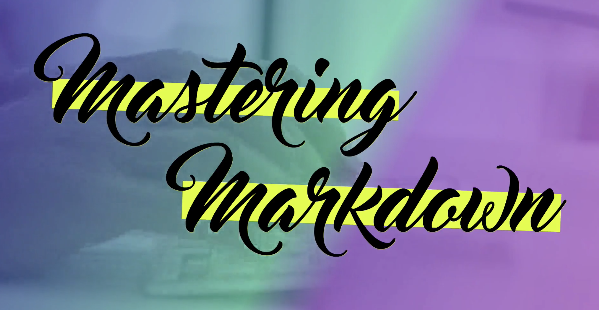

# Notes

Installed the _Markdown All-in-One_ extension for VSCode

I'm **super excited**

## Paragraphs
- need a full empty line between if you want there to be a space 

### Examples

These two lines do not have a full
empty line between them in the file.

These two lines do have a full

empty line between them in the file.


## Italics 
- Can be done with single *asterisks* or with _underline_
- I changed the Italics Indicator in the Markdown settings to _underline_


## Bold
- Can be done with double **asterisks** or with __underline__
- I will use **asterisks** for Bold


## Strikethrough
- this requires double ~~tildas~~


## Links
<http://wesbos.com>

[My Github Account](https://github.com/PastranaDigital)

[Apple.com](https://www.apple.com/mac-mini/specs/ "Mac Mini Specs")
<!-- The text in the quotes above are shown on hover of the link as a tool tip -->

Make sure you check out [Wes'][1] Sites.

If you want to learn [React][react], you can learn at React for beginners.com - [Wes][1] did a great job on this.

[1]: http://wesbos.com
[react]: http://react.com


## Images
! = it is an image

[] = the alt text for the image

() = the src url link




![Cute pic][pic]

[pic]: https://unsplash.it/400/401

[](https://unsplash.it/400/400?image=1000)


## Lists
### Ingredients

- milk
- eggs
- bread
  - wheat
  - white
  - sourdough
- bacon


## Steps
<!-- No need to give numbers, it will get figured out by the viewer -->
1. Combine
   1. sift the flour
      1. yes sift it
        
        This is inline
        
        
        ```js
            console.log(`is this working ${answer}`);
        ```
2. Bowl
3. Stir
4. Bake

## Line breaks
This is cool<br>
This really is.

And so is this.

## Horizontal Rules

Some words

---

Another set of words

=====

Important to note that there needs to be a line between the HR and text otherwise it will be read as H1 or H2

## Block quotes

> You miss 100% of the shots you don't take.
> 
> **Wayne Gretzky**

## Code Blocks
<!-- indentation method -->
Here is my code:

    function toggleActive(e) {
        console.log(e.propertyName);
        if(e.propertyName.includes('flex')) {
            this.classList.toggle('open-active');
        }
    }

<!-- using triple back ticks -->
Here is my code:
<!-- adding the language will add highlighting -->
```js
function toggleActive(e) {
    console.log(e.propertyName);
    if(e.propertyName.includes('flex')) {
        this.classList.toggle('open-active');
    }
}
```

### Using it inline

Hey did you try `var x=100;`?

### Showing the difference needed to occur
```diff
var x = 100;
- var y = 200;
+ var y = 300;
```


## Tables
Where you place the : decides (left, center or right justify)

|Dog's Name| Dog's Age| Dog's Birthday|
|:------|:-------:|-----:|
|Snickers|2|01-25-2022|
|Penny| 4|04-22-2022|